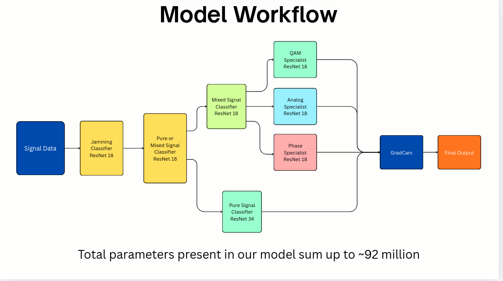
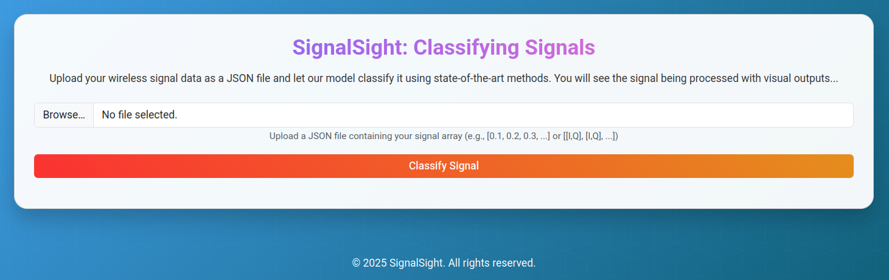

# 📡 SignalSight – Signal Classification System

SignalSight is an end-to-end intelligent signal classification system built to identify and interpret digital modulation types using deep learning and real-time visualization. It integrates a trained hierarchical model with a user-friendly Flask web interface that allows anyone to upload wireless signal data and view classification results with interpretability.

It automates complex modulation recognition by converting 1D I/Q signals into 2D spectrograms and passing them through a multi-stage classifier pipeline. The system distinguishes between pure, mixed, and jammed/spoofed signals while visualizing critical spectrogram regions that influenced each decision.

---

## 📌 Table of Contents

- [✨ Key Features](#-key-features)
- [🧩 Tech Stack](#-tech-stack)
- [🧠 Trained Models](#-trained-models)
- [🚀 How to Run the Project](#-how-to-run-the-project)
- [📈 Project Architecture](#-project-architecture)
- [🏭 Industrial Applications](#-industrial-applications)
- [🌐 User Interface Highlights](#-user-interface-highlights)

---

## ✨ Key Features

- 🎯 Converts 1D signal arrays into 2D spectrograms for model inference  
- 🔁 Hierarchical classification pipeline (pure, mixed, and spoofed signals)  
- 🧠 Specialized CNN trained for various SNR levels  
- 🖥️ Flask-based web UI for easy real-time testing and visualization  
- 🔍 Interpretable AI via Grad-CAM — highlights decisive spectrogram regions  
- ⚙️ Supports classification across 24 digital modulation types (QAM, PSK, AM, FM, etc.)  

---

## 🧩 Tech Stack

| Component            | Technology |
|---------------------|-----------|
| Programming         | Python |
| Backend Framework   | Flask |
| Deep Learning       | PyTorch |
| Signal Processing   | Matplotlib |
| Visualization       | Grad-CAM |
| Dataset             | RadioML 2018.01A |
| UI Frontend         | HTML/CSS |

---

## Model Workflow

---

## 🧠 Trained Models

Pre-trained `.pth` model files located in `checkpoints/`:

- `best_pure_cnn_model.pth` – Pure signal classifier  
- `best_pure_mixed_model.pth` – Mixed signal classifier  
- `best_qam_specialist_model.pth` – QAM modulation specialist  
- `best_phase_specialist_model.pth` – Phase modulation specialist  
- `best_analog_specialist_model.pth` – Analog modulation specialist  
- `best_jamming_classifier_model.pth` – Spoofing and jamming detector  
- `best_router_model.pth` – SNR routing model  

---

## 🚀 How to Run the Project

### 1️⃣ Clone, Install & Start (single code block)
    # Clone the repository
    git clone https://github.com/your-username/Signal-Sight.git
    cd Signal-Sight

    # Install dependencies
    pip install -r requirements.txt

    # Start the Flask server
    python app.py

### 2️⃣ Verify Model Files
Ensure all `.pth` model files are present inside the `checkpoints/` directory:
- `best_pure_cnn_model.pth`
- `best_pure_mixed_model.pth`
- `best_qam_specialist_model.pth`
- `best_phase_specialist_model.pth`
- `best_analog_specialist_model.pth`
- `best_jamming_classifier_model.pth`
- `best_router_model.pth`

### 3️⃣ Access the Web Interface
Open your browser and go to:  
`http://127.0.0.1:5500/Signal-Sight/templates/index.html`

### 4️⃣ Classify a Signal
- Paste your I/Q signal data (JSON array, e.g., `[0.1, 0.2, 0.3, ...]`) into the input box.  
- Click **Classify Signal**.  
- View the predicted modulation type plus the Grad-CAM heatmap for interpretability.

